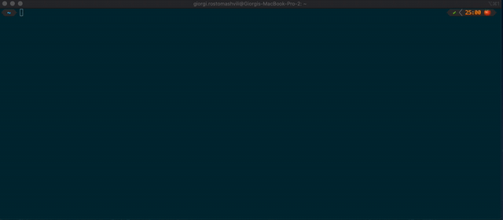

# Pomodoro

Over-engineered Pomodoro cli app. It has a client and a server 😅



# CLI

```
Over-engineered Pomodoro 0.4.2

USAGE:
    pomodoro [SUBCOMMAND]

FLAGS:
    -h, --help       Prints help information
    -V, --version    Prints version information

SUBCOMMANDS:
    get-session    Prints pomodoro session
    help           Prints this message or the help of the given subcommand(s)
    next           Start next pomodoro session
    reset          Reset pomodoro rounds
    run-server     Run pomodoro server
    set            Sets remaning time in pomodoro session
    show           Prints remaining time and round
    start          Starts pomodoro session
    stop           Stops pomodoro session
```
